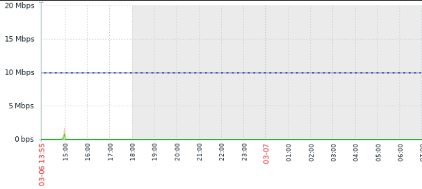

## Cisco-Zabbix-Policer 
Cisco-Zabbix-Policer is an automation script that is customized to monitor subinterfaces on a Cisco routerers and 
create triggers using the configured policer speeds using Zabbix triggers.

The script uses PyZabbix to intereact with tha zabbix database and to create , update and delete triggers from zabbix , although there are some internal configurations in the zabbix server and the Web GUI so that the script starts functioning.
So, let's dig in and see how auto_snmp_cisco.py works and it's OID-s.
The MIB being used under this Context is CISCO-CLASS-BASED-QOS-MIB

1. First , script snmpwalks through ```1.3.6.1.4.1.9.9.166.1.5.1.1.2``` which lists thourgh all cbQosConfigIndex per interface by the classmaps configured. In our case Class default is on ```65538``` , the integar before ```65538``` indicates the map index which will be used frquenctly later on.
2. Second , In order to get the policy cir configured we take the trap value from step 1 under the class default , and add to this OID ```1.3.6.1.4.1.9.9.166.1.12.1.1.1.{PolicyValue}```.
2. Third, To know on which direction the policy is configured Inbound or Outbound , the cbQosPolicyDirection OID can be used which is ```1.3.6.1.4.1.9.9.166.1.1.1.1.3.{MapIndex}``` + the map index which we got a step before.
3. Fourth, to get the IfIndex we must know on which interface this map was configured using thecbQosIfIndex which is ```1.3.6.1.4.1.9.9.166.1.1.1.1.4.{MapIndex}``` + map index.
4. Fifth, to get the ifName we use the ifIndex from step 3, ```1.3.6.1.2.1.31.1.1.1.1.{IfIndex}```.


Now we can start working on Zabbix Web.
1. Create a host for the Cisco device and monitor it
    with SNMP community conifgured on the device.(#Dont forget to replace the hostname in auto_add_cisco.py!!!)
2. Create a discovery rule on the Host created with SNMP agent type and SNMP OID of ```discovery[{#IFALIAS},1.3.6.1.2.1.31.1.1.1.18,{#IFNAME},1.3.6.1.2.1.31.1.1.1.1]``` ,
    this will discover all the subinterfaces and interfaces present on the juniper device
3. Create 2 Item prototypes for Inbound and Outbound traffic

## For Inbound:
```
Name:   {#IFNAME} - {#IFALIAS} - Inbound traffic
key:    1.3.6.1.2.1.31.1.1.1.6.[{#IFNAME}]
OID:    1.3.6.1.2.1.31.1.1.1.6.{#SNMPINDEX}
```
## For Outbound:
```
Name:   {#IFNAME} - {#IFALIAS} - Outbound traffic
Key:    1.3.6.1.2.1.31.1.1.1.10.[{#IFNAME}]
OID:    1.3.6.1.2.1.31.1.1.1.10.{#SNMPINDEX}
```

For more information about Cisco MIB and OIDs go through this link https://snmp.cloudapps.cisco.com/Support/SNMP/do/BrowseOID.do
<hr>
-  Create a autodiscovered graph to combine outbound and inbound for each subinterface.(optional)

- Note: it is important to put the Key as mentioned in the documentation to not face any errors.
<hr>
Now add auto_snmp_cisco.py and auto_add_cisco.py to zabbix server and modify the variables inside it as of comments 

after modifieing add a cronjob so that every 5 minutes the script updates the triggers
#### Cronjob to be configured
```
*/5 * * * * sudo /usr/bin/python3 /home/zabbix/scripts/auto_add_cisco.py
```
Now under monitoring the latest data for each subinterface a new trigger must be created with infomation severity level
## Latest Data


